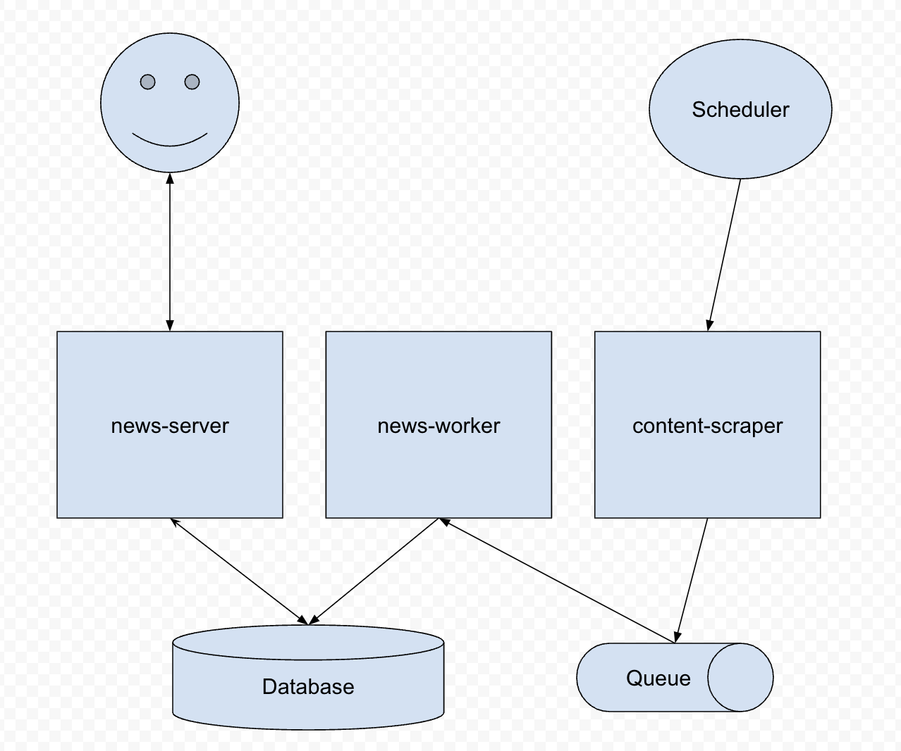

# Daily Trends

API que expone un feed de noticias.
Este feed es un
agregador de noticias de diferentes periódicos.
DailyTrends es un periódico que une las portadas de los periódicos número uno.

## Run Locally

Clone the project

```bash
  git clone https://github.com/pablogm95/daily-trends.git
```

Go to the project directory

```bash
  cd daily-trends
```

Start docker compose to set up all services

```bash
  docker-compose up
```


## Services

The services are structured in:
- **News server**: API service to manually write and read feeds
- **News worker**: Worker service to listen feed events and write in database
- **Content server**: Scraper service to scrap websites and publish events





## Tech Stack

- Node
- Typescript
- Express
- Puppeteer
- GCloud
- PubSub

## Running Tests

To run tests, run the following command

```bash
  npm run test
```
